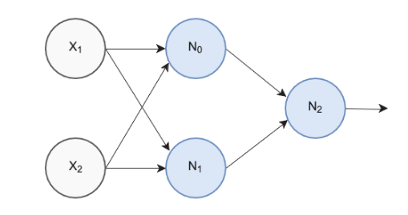

# AI-application-systems - Timur Khairulov (12224993)

## 
### Goals of week 3:
- [x] Learn how does a single neuron work
- [x] Learn how does a backpropagation algorithm work
- [x] Implement a simple neural network without frameworks
- [x] Train a network to solve the XOR problem

### XOR Problem

For solving a XOR problem the following structure of neural network was developed



It has 2 inputs, 1 hidden layer containing 2 neurons and 1 output neuron

### Backpropagation
The backpropagation algorithm consists of 3 steps:
1. forward_pass

```python
def forward_pass(x):
  """
    First step of back propagation algorithm
  """
  global n_y
  n_y[0] = np.tanh(np.dot(n_w[0],x))
  n_y[1] = np.tanh(np.dot(n_w[1],x))

  n2_inputs = np.array([1.0, n_y[0], n_y[1]])
  z2=np.dot(n_w[2], n2_inputs)
  n_y[2] = 1.0/(1.0 + np.exp(-z2))
 ```
 2. backward_pass
 
 ```python
 def backward_pass(y_truth):
  """
    Second step of back propagation algorithm
  """
  global n_error
  error_prime = -(y_truth - n_y[2])
  derivative = n_y[2] * (1.0 - n_y[2])
  n_error[2] = error_prime * derivative
  derivative = 1.0 - n_y[0]**2
  n_error[0] = n_w[2][1] * n_error[2] * derivative
  derivative = 1.0 - n_y[1]**2
  n_error[1] = n_w[2][2] * n_error[2] * derivative
```
3. adjusting weights
```python
def adjust_weights(x):
  """
    Process of weights adjusting
  """
  global n_w
  n_w[0] -= (x * LEARNING_RATE * n_error[0])
  n_w[1] -= (x * LEARNING_RATE * n_error[1])
  n2_inputs = np.array([1.0, n_y[0], n_y[1]]) # 1.0 is bias
  n_w[2] -= (n2_inputs * LEARNING_RATE * n_error[2])
```

### Result
Eventually, the neural network of 3 neurons learnt to solve the XOR problem

## 
### Goals of week 4:
- [x] Exploring the MNIST dataset

### Result
After downloading the dataset and unpacking it the 6-th element was tasken for observation.
```
label for first training example:  2
---beginning of pattern for first training example---
                            
                            
                            
                            
                            
               *****        
             *******        
           **********       
         ************       
         ******* ****       
         ******  ****       
         ****    ****       
                 ****       
             ********       
          **********        
        *************       
       ****** ********      
      ****** ************   
     ****** ***** *******   
     ***********     ****   
     **********             
     *********              
     ******                 
                            
                            
                            
                            
                            
---end of pattern for first training example---
```
Here we can see that the 6-th element in dataset is a handwritten '2'.


