# AI-application-systems - Timur Khairulov (12224993)

# 
### Goals of week 3:
- [x] Learn how does a single neuron work
- [x] Learn how does a backpropagation algorithm work
- [x] Implement a simple neural network without frameworks
- [x] Train a network to solve the XOR problem

### XOR Problem

For solving a XOR problem the following structure of neural network was developed


It has 2 inputs, 1 hidden layer containing 2 neurons and 1 output neuron

### Backpropagation
The backpropagation algorithm consists of 3 steps:
1. forward_pass

```python
def forward_pass(x):
  """
    First step of back propagation algorithm
  """
  global n_y
  n_y[0] = np.tanh(np.dot(n_w[0],x))
  n_y[1] = np.tanh(np.dot(n_w[1],x))

  n2_inputs = np.array([1.0, n_y[0], n_y[1]])
  z2=np.dot(n_w[2], n2_inputs)
  n_y[2] = 1.0/(1.0 + np.exp(-z2))
 ```
 2. backward_pass
 
 ```python
 def backward_pass(y_truth):
  """
    Second step of back propagation algorithm
  """
  global n_error
  error_prime = -(y_truth - n_y[2])
  derivative = n_y[2] * (1.0 - n_y[2])
  n_error[2] = error_prime * derivative
  derivative = 1.0 - n_y[0]**2
  n_error[0] = n_w[2][1] * n_error[2] * derivative
  derivative = 1.0 - n_y[1]**2
  n_error[1] = n_w[2][2] * n_error[2] * derivative
```
3. adjusting weights
```python
def adjust_weights(x):
  """
    Process of weights adjusting
  """
  global n_w
  n_w[0] -= (x * LEARNING_RATE * n_error[0])
  n_w[1] -= (x * LEARNING_RATE * n_error[1])
  n2_inputs = np.array([1.0, n_y[0], n_y[1]]) # 1.0 is bias
  n_w[2] -= (n2_inputs * LEARNING_RATE * n_error[2])
```

### Result
Eventually, the neural network of 3 neurons learnt to solve the XOR problem


# 
### Goals of week 4:
- [x] Exploring the MNIST dataset

### Result
After downloading the dataset and unpacking it the 6-th element was tasken for observation.
```
label for first training example:  2
---beginning of pattern for first training example---
                            
                            
                            
                            
                            
               *****        
             *******        
           **********       
         ************       
         ******* ****       
         ******  ****       
         ****    ****       
                 ****       
             ********       
          **********        
        *************       
       ****** ********      
      ****** ************   
     ****** ***** *******   
     ***********     ****   
     **********             
     *********              
     ******                 
                            
                            
                            
                            
                            
---end of pattern for first training example---
```
Here we can see that the 6-th element in dataset is a handwritten '2'.


# 
### Goals of week 5:
- [x] Learn how to create variables in tensorflow
- [x] Learn how to create constants in tensorflow
- [x] Learn how to create placeholders in tensorflow
- [x] Learn how to work with the tesorboard
- [x] Learn how to create a computational graph in tensorflow
- [x] Learn how to use `tf.summary.scalar` and `tf.summary.histogram` commands

### Variables in tensorflow
Variables are tensors trainable during a session.
In tensotrflow they are defined using following syntax: `a = tf.Variable(0, name = 'input')`

### Constants in tensorflow
Constants are tensors that are NOT trainable during a session.
In tensotrflow they are defined using following syntax: `b = tf.constant(5)`

### Placeholders
Placeholders are tensors whose values are unknown during the graph construction but passed as input during a session.
They can be defined with this syntax: `x = tf.placeholder("float32", None)`

### Computational graph
Next, we define a computational graph:
```python
a = tf.add(1,2, name="addition_1")
b = tf.multiply(a,3, name="multiplying_1")
c = tf.add(4,5, name="addition_2")
d = tf.multiply(c,6, name="multiplying_2")
e = tf.multiply(4,5)
f = tf.div(c,6, name="division")

g = tf.add(b,d)
h = tf.multiply(g,f)
```
and then we can visualize it via the tensorboard.
Tensorboards are avaliable to be ran inside the cells of google colab.
For enabling inline tensorboard run `%load_ext tensorboard`
and `%tensorboard --logdir='./logs'` with specified logging folder used in program.\
The output of a tensorboard with computational graph looks like this:
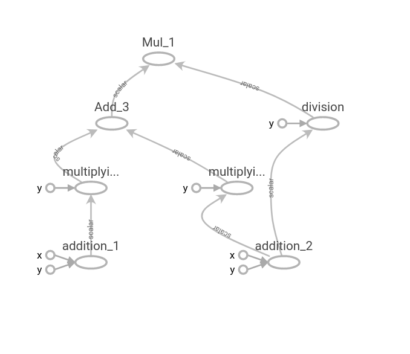

## `tf.summary.scalar` and `tf.summary.histogram` commands
To understand how these commands work, let's run a following script:
```python
tf.reset_default_graph()
s_scalar = tf.get_variable(name='s_scalar',
                           shape=[],
                           initializer=tf.truncated_normal_initializer(
                               mean=0,
                               stddev=1
                           ))

y_matrix = tf.get_variable(name='y_matrix',
                           shape=[40,50],
                           initializer=tf.truncated_normal_initializer(
                               mean=0,
                               stddev=1
                           ))

# A scalar summary for scalar tensor
first_summary = tf.summary.scalar(name='First_summary', tensor = s_scalar)

# A histogram summary for non-scalar tensor 2-D and 3-D matrix
histogram_summary = tf.summary.histogram('histogram_summary', y_matrix)

init = tf.global_variables_initializer()

with tf.Session() as sess:
  writer = tf.summary.FileWriter('./logs', sess.graph)

  for i in range(100):
    sess.run(init)
    summary1, summary2 = sess.run([first_summary, histogram_summary])
    writer.add_summary(summary1, i)
    writer.add_summary(summary2, i)
```
Now we can visualize results in tensorboard
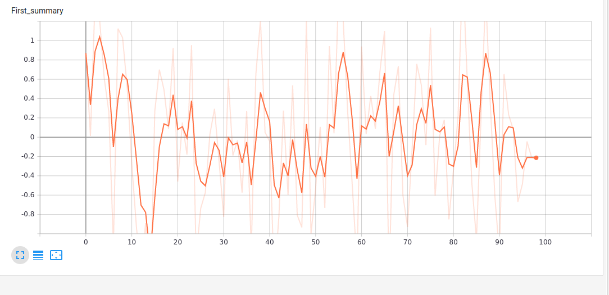


# 
### Goals of week 6-1:
- [x] Perform the linear regression using tensorflow
- [x] Show the learning process of a linear regression model
- [x] Design and train neural network for MNIST dataset digit classification
- [x] Test learning parameters on an image from the web

### Linear regression
Let's make a model for linear regression problem and train it
```python
Y = tf.placeholder(tf.float32)
X = tf.placeholder(tf.float32)

W = tf.Variable(np.random.randn(), name = 'weights')
B = tf.Variable(np.random.randn(), name = 'bias')
```
```python
# Create model for regression
with tf.name_scope("Model") as scope:
  prediciton = W*X + B

# Add summary to study behavior of weights and biases with epochs
weight_histogram = tf.summary.histogram("Weights", W)
bias_histogram = tf.summary.histogram("Bias", B)

# Cost function
with tf.name_scope('Cost_function') as scope:
  cost_function = tf.reduce_sum((prediction-Y)**2 / (2*sample_points))

# Record the scalar summary of the cost funciton
cost_summary = tf.summary.scalar("Cost", cost_iteration)

# Define the optimizer
with tf.name_scope("Training") as scope:
  optimizer = tf \
              .train \
              .GradientDescentOptimizer(learning_parameter) \
              .minimize(cost_iteration)

# Initialize the variables
init = tf.global_variables_initializer()

# Merge all the summaries into a single operator
merged_summary = tf.summary.merge_all()
```
Result:
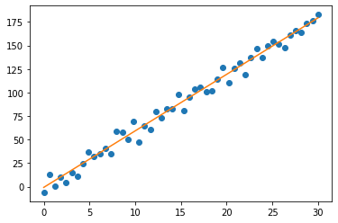
As we can see, model works and we received the desired output.
Red line represents the trained model and blue dots represent data.

### Neural Network for MNIST digit classification
At first, we need to define parameters of neural network
```python
n_input = 784 # Input image of size 28 x 28
n_hidden_1 = 512 # First hidden layer
n_hidden_2 = 256 # Second hidden layer
n_hidden_3 = 128 # Third hidden layer
n_output = 10 # Output layer having (0-9) digits

learning_rate = 1e-4
epochs = 3000
batch_size = 128
```
Next step is to connect layers and create the network
```python
nn_weight = {"W1" : tf.Variable(tf.truncated_normal([n_input, n_hidden_1], stddev=0.1)),
             "W2" : tf.Variable(tf.truncated_normal([n_hidden_1, n_hidden_2], stddev=0.1)),
             "W3" : tf.Variable(tf.truncated_normal([n_hidden_2, n_hidden_3], stddev=0.1)),
             "Wout" : tf.Variable(tf.truncated_normal([n_hidden_3, n_output]))
}

nn_bias = {"B1" : tf.Variable(tf.truncated_normal([n_hidden_1])),
           "B2" : tf.Variable(tf.truncated_normal([n_hidden_2])),
           "B3" : tf.Variable(tf.truncated_normal([n_hidden_3])),
           "B4" : tf.Variable(tf.truncated_normal([n_output]))
}

nn_layer_1 = tf.add(tf.matmul(X, nn_weight["W1"]), nn_bias["B1"])
nn_layer_2 = tf.add(tf.matmul(nn_layer_1, nn_weight["W2"]), nn_bias["B2"])
nn_layer_3 = tf.add(tf.matmul(nn_layer_2, nn_weight["W3"]), nn_bias["B3"])
layer_drop = tf.nn.dropout(nn_layer_3, keep_prob)
output_layer = tf.add(tf.matmul(layer_drop, nn_weight["Wout"]), nn_bias["B4"])
```

Choosing loss, prediction, optimizer and model accuracy
```python
# Define the loss
computed_loss = tf.reduce_mean(tf.nn.softmax_cross_entropy_with_logits_v2(
              logits=output_layer, labels=Y)
)

# Define the optimizer
optimizer = tf\
            .train\
            .GradientDescentOptimizer(learning_rate = learning_rate)\
            .minimize(computed_loss)

# Define prediction
prediction_out = tf.equal(tf.argmax(output_layer,1), tf.argmax(Y,1))

# Define accuracy of model
nn_accuracy = tf.reduce_mean(tf.cast(prediction_out, tf.float32))
```
After training all parameters were saved to a file, so they could be used further in a new model
```
Optimization Finished
Testing accuracy is 0.8561999797821045
```

### Testing on an image
For the test, an image of '7' was downloaded from the web.\
Next, we can use previously saved weights to create a new model that will make a prediction.\
Result:\
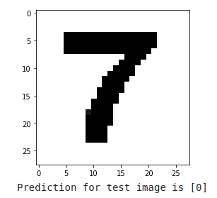

# 
### Goals of week 6-2:
- [x] Explore the Fashion MNIST dataset
- [x] Perform image denoising unsing Neural Network

### Exploring the Fashion MNIST dataset
Dataset consists of low resolution pictures of clothes and accessories.\
Let's randomly pick an item from dataset and display it.\
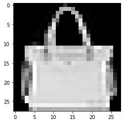

Now let's prepare a noisy dataset, that Neural Network will try to clear out\

```python
X_train_noisy = X_train + 10*np.random.normal(0,1,size=X_train.shape)
```
Noisy image looks like this:\
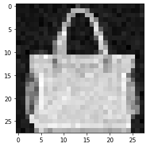

### Building a model
Let's define parameters of a Neural Network
```python
n_input = 784 # Input image is of size 28 x 28 
hidden_layer_1 = 256
hidden_layer_2 = 32
hidden_layer_3 = 32
hidden_layer_4 = 256
output_layer = 784 # Same as the n_input dimension

# Parameters
learning_rate = 0.1
epochs = 100
batch_size = 100
```
Weights and Biases
```python
Weight_NN = {"W1" : tf.Variable(tf.random_normal([n_input, hidden_layer_1])),
             "W2" : tf.Variable(tf.random_normal([hidden_layer_1, hidden_layer_2])),
             "W3" : tf.Variable(tf.random_normal([hidden_layer_2, hidden_layer_3])),
             "W4" : tf.Variable(tf.random_normal([hidden_layer_3, hidden_layer_4])),
             "W5" : tf.Variable(tf.random_normal([hidden_layer_4, output_layer]))
}

Bias_NN = {"B1" : tf.Variable(tf.random_normal([hidden_layer_1])),
           "B2" : tf.Variable(tf.random_normal([hidden_layer_2])),
           "B3" : tf.Variable(tf.random_normal([hidden_layer_3])),
           "B4" : tf.Variable(tf.random_normal([hidden_layer_4])),
           "B5" : tf.Variable(tf.random_normal([output_layer]))
}
```
Now we can connect layers
```python
Z1 = tf.add(tf.matmul(X, Weight_NN["W1"]), Bias_NN["B1"])
Z1_out = tf.nn.sigmoid(Z1)

Z2 = tf.add(tf.matmul(Z1_out, Weight_NN["W2"]), Bias_NN["B2"])
Z2_out = tf.nn.sigmoid(Z2)

Z3 = tf.add(tf.matmul(Z2_out, Weight_NN["W3"]), Bias_NN["B3"])
Z3_out = tf.nn.sigmoid(Z3)

Z4 = tf.add(tf.matmul(Z3_out, Weight_NN["W4"]), Bias_NN["B4"])
Z4_out = tf.nn.sigmoid(Z4)

Z5 = tf.add(tf.matmul(Z4_out, Weight_NN["W5"]), Bias_NN["B5"])
Z5_out = tf.nn.sigmoid(Z5)

Z1 = tf.layers.dense(X, hidden_layer_1, activation = tf.nn.sigmoid)
Z2 = tf.layers.dense(Z1, hidden_layer_2, activation = tf.nn.sigmoid)
Z3 = tf.layers.dense(Z1, hidden_layer_3, activation = tf.nn.sigmoid)
Z4 = tf.layers.dense(Z1, hidden_layer_4, activation = tf.nn.sigmoid)
NN_output = tf.layers.dense(Z4, output_layer)
```
And define metrics
```python
# The loss funciton
computed_loss = tf.reduce_mean(tf.square(NN_output-Y))

# Define the optimizer
optimizer = tf.train.AdagradOptimizer(learning_rate).minimize(computed_loss)
```
Now Neural Network can be trained.
```
Epoch 99 / 100 loss 2750.8054
```
After training we can try denoising an image using prepared Neural Network and compare the results.\
Original image:\


Noisy image:\
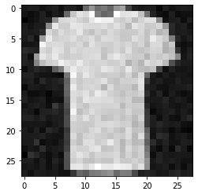

Denoised image:\
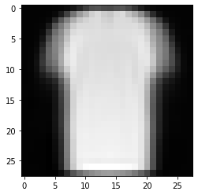


# 
### Goals of week 7-1:
- [x] Exploring the CIFAR10 dataset

### Result
Let's import the dataset using following command: `from torchvision.datasets import CIFAR10`\
Now we can take a look at example data, stored in the dataset:\
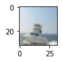\
This image has category '8'

# 
### Goals of week 7-2:
- [x] Building a model for predicting category in the CIFAR10 dataset

### Result
Let's configure a model
```python
# Model with 2 convolutional and 1 fully-connected layer
model = nn.Sequential(
    nn.Conv2d(3, 64, 5, stride=2, padding=2), # Output is 64x16x16
    nn.ReLU(),
    nn.Conv2d(64, 64, 3, stride=2, padding=1), # Output is 64x8x8
    nn.ReLU(),
    nn.Flatten(),
    nn.Linear(64 * 8 * 8, 10)
)
```
```python
# Retrieve layers for custom weight initialization
layers = next(model.modules())
conv_layer0 = layers[0]
conv_layer1 = layers[2]
output_layer = layers[5]

# Kaiming (He) initialization
nn.init.kaiming_normal_(conv_layer0.weight)
nn.init.constant_(conv_layer0.bias, 0.0)
nn.init.kaiming_normal_(conv_layer0.weight)
nn.init.constant_(conv_layer1.bias, 0.0)

# Xavier (Glorot) initialization
nn.init.xavier_uniform_(output_layer.weight)
nn.init.constant_(output_layer.bias, 0.0)

# Loss function and optimizer
optimizer = torch.optim.Adam(model.parameters())
loss_function = nn.CrossEntropyLoss()
```
Training:
```python
# Train the model
train_model(model, device, EPOCHS, BATCH_SIZE, trainset, testset, optimizer, loss_function, 'acc')
```

Training result:
```python
Epoch 128/128 loss: 0.1304 - acc: 0.9665 - val_loss: 10.4689 - val_acc: 0.5475

[0.96649072296865, 0.5475239616613419]
```


# 
### Goals of week 9-1:
- [x] Building a neural network using Keras Sequential and Keras Dense

### Result
Let's build a model:
```python
model = Sequential()
model.add(Dense(64, activation='relu', input_shape=[13]))
model.add(Dense(64, activation='relu'))
model.add(Dense(1, activation='linear'))
model.compile(loss="mean_squared_error", optimizer="adam", 
              metrics=["mean_absolute_error"])
```

We will train and test our model on keras `boston_housing` dataset
```python
boston_housing = keras.datasets.boston_housing
(raw_x_train, y_train), (raw_x_test, y_test) = boston_housing.load_data()
```
Model's results:
```python
Prediction:  6.04861 , true_value:  7.2
Prediction:  19.704561 , true_value:  18.8
Prediction:  20.227697 , true_value:  19.0
Prediction:  33.061592 , true_value:  27.0
```
# 
### Goals of week 9-2:
- [x] Comparing different neural network architectures
- [x] Learning about dropout in neural network architectures

### Result
5 different neural network architectures were tested:
- Configuration 5
```python
model = Sequential()
model.add(Dense(128, activation='relu', input_shape=[13]))
model.add(Dropout(0.3))
model.add(Dense(128, activation='relu'))
model.add(Dropout(0.3))
model.add(Dense(64, activation='relu'))
model.add(Dropout(0.3))
model.add(Dense(1, activation='linear'))

model.compile(loss="mean_squared_error", optimizer="adam", 
              metrics=["mean_absolute_error"])
```
- Configuration 4
```python
model = Sequential()
model.add(Dense(128, activation='relu', input_shape=[13]))
model.add(Dropout(0.2))
model.add(Dense(128, activation='relu'))
model.add(Dropout(0.2))
model.add(Dense(64, activation='relu'))
model.add(Dropout(0.2))
model.add(Dense(1, activation='linear'))

model.compile(loss="mean_squared_error", optimizer="adam", 
              metrics=["mean_absolute_error"])
```
- Configuration 3
```python
model = Sequential()
model.add(Dense(64, activation='relu', input_shape=[13]))
model.add(Dropout(0.2))
model.add(Dense(64, activation='relu'))
model.add(Dropout(0.2))
model.add(Dense(1, activation='linear'))

model.compile(loss="mean_squared_error", optimizer="adam", 
              metrics=["mean_absolute_error"])
model.summary()
```
- Configuration 2
```python
model = Sequential()
model.add(Dense(64, activation='relu',
kernel_regularizer=l2(0.1),
bias_regularizer=l2(0.1),
input_shape=[13]))
model.add(Dense(64, activation='relu',
kernel_regularizer=l2(0.1),
bias_regularizer=l2(0.1)))
model.add(Dense(1, activation='linear',
kernel_regularizer=l2(0.1),
bias_regularizer=l2(0.1)))

model.compile(loss="mean_squared_error", optimizer="adam", 
              metrics=["mean_absolute_error"])
```
- Configuration 1
```python
model = Sequential()
model.add(Dense(64, activation='relu', input_shape=[13]))
model.add(Dense(64, activation='relu'))
model.add(Dense(1, activation='linear'))

model.compile(loss="mean_squared_error", optimizer="adam", 
              metrics=["mean_absolute_error"])
```

All architectures were tested and trained on a keras `boston_housing` dataset
```python
boston_housing = keras.datasets.boston_housing
(raw_x_train, y_train), (raw_x_test, y_test) = boston_housing.load_data()
```

Model evealations are given in the following table
|CONFIGURATION|TOPOLOGY|REGULARIZATION|TRAINING ERROR| TEST ERROR|
|:-------------:|:--------:|:--------------:|:--------------:|:-----------:|
|Conf1|64/64/1|None|0.76|12.8|
|Conf2|64/64/1|L2=0.1|8.9|20.6|
|Conf3|64/64/1|Dropout=0.2|10.0|12.6|
|Conf4|128/128/64/1|Dropout=0.2|7.3|13.0|
|Conf5|128/128/64/1|Dropout=0.3|11.3|13.0|

# 
### Goals of week 10-1:
- [x] Working with keras Resnet50

### Result
As a sample image for working with resnet50 was choosen this picture of a dog:
-- picutre of a dog
At first we need to preprocess the chosen image
```python
preprocess = transforms.Compose([
    transforms.Resize((224,224)),
    transforms.ToTensor(),
    transforms.Normalize(mean=[0.485, 0.456,0.406], std=[0.229, 0.224, 0.225])
]) # Parameters recommended by pytorch.org
input_tensor = preprocess(image)
```
Then, we load pretrained model
```python
model = torchvision.models.resnet50(weights=torchvision.models.ResNet50_Weights.IMAGENET1K_V1)
model.eval()
```
Make the prediction
```python
inputs = inputs.to(device)
with torch.no_grad():
  outputs = model(inputs)
```
And print 5 most probable classes
```python
_, indices = torch.sort(probabilities, descending=True)
for i in range(0,5):
  print("Image class:", indices[i].item(), ", probability = %4.3f" % probabilities[indices[i]].item())
```
As a result we get the following data:
```
Image class: 232 , probability = 0.649
Image class: 231 , probability = 0.131
Image class: 200 , probability = 0.110
Image class: 193 , probability = 0.018
Image class: 199 , probability = 0.010
```

# 
### Goals of week 10-2:
- [x] Working with keras Sequential
- [x] Working with keras API

### Result
Let's create a simple Sequential model...
```python
model = keras.Sequential([
    layers.Dense(64, activation="relu"),
    layers.Dense(10, activation="softmax")
])
```
..and build it
```python
model.build(input_shape=(None, 3))
```
It is possible to build the same configuration incrementally
```python
inputs = keras.Input(shape=(3,), name="my_input")
features = layers.Dense(64, activation="relu")(inputs)
outputs = layers.Dense(10, activation="softmax")(features)
model = keras.Model(inputs=inputs, outputs=outputs)
```
Let's take a look at the model that was built using `model.summary()` method
```
Model: "model_1"
_________________________________________________________________
 Layer (type)                Output Shape              Param #   
=================================================================
 my_input (InputLayer)       [(None, 3)]               0         
                                                                 
 dense_6 (Dense)             (None, 64)                256       
                                                                 
 dense_7 (Dense)             (None, 10)                650       
                                                                 
=================================================================
Total params: 906
Trainable params: 906
Non-trainable params: 0
```
# 
### Goals of week 11:
- [x] Working with real data
- [x] Predicting bookstore monthliy sales  

### Result
At first let's explore given dataset
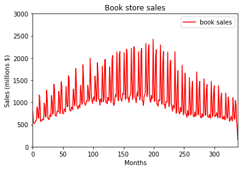
Now, let's make a naive prediction by shifitng a given data
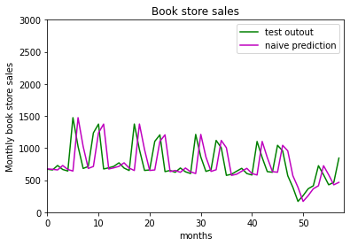
Time to build and train a RNN
```python
# Custom layer that retrieves only last time step from RNN output.
class LastTimestep(nn.Module):
  def forward(self, inputs):
    return inputs[1][0]

# Create RNN model
model = nn.Sequential(
    nn.RNN(1,128, nonlinearity='relu', batch_first=True),
    LastTimestep(),
    nn.Linear(128, 1)
)

# Loss function and optimizer
optimizer = torch.optim.Adam(model.parameters())
loss_function = nn.MSELoss()

# Train model
train_model(model, device, EPOCHS, BATCH_SIZE, trainset, testset, optimizer,
            loss_function, "mae")     
```
Now we can plot the prediciton of our RNN
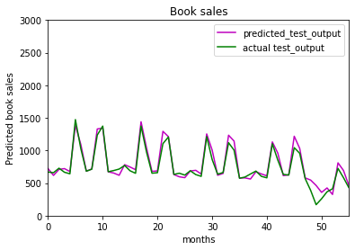


# 
### Goals of week 12:
- [x] Working with real data
- [x] Trying different approaches starting from non-machine learning method
- [x] Understanding RNNs

### Result
Given the jena_clinmate data `!wget https://s3.amazonaws.com/keras-datasets/jena_climate_2009_2016.csv.zip`
Let's plot the dataset
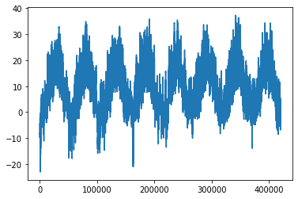
After data preprocessing and preparing, let's make a common sence non-machine learning model
```python
def evaluate_naive_method(dataset):
  total_abs_err = 0.
  samples_seen = 0
  for samples, targets in dataset:
    preds = samples[:,-1,1] * std[1] + mean[1]
    total_abs_err += np.sum(np.abs(preds-targets))
    samples_seen += samples.shape[0]
  return total_abs_err / samples_seen
```
The results of this model are
```
Validation MAE: 2.44
Test MAE: 2.62
```
Next approach is a densely connected network
```python
model = keras.models.load_model("jena_dense.keras")
```
And its result
```
Test MAE: 2.65
```
Let's plot the results
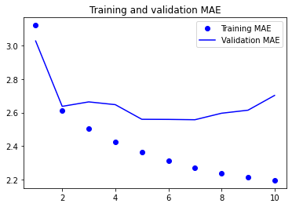
Moving on to a 1D convolution model
```python
inputs = keras.Input(shape=(sequence_length, raw_data.shape[-1]))
x = layers.Conv1D(8, 24, activation="relu")(inputs)
x = layers.MaxPooling1D(2)(x)
x = layers.Conv1D(8, 12, activation="relu")(x)
x = layers.MaxPooling1D(2)(x)
x = layers.Conv1D(8, 6, activation="relu")(x)
x = layers.GlobalAveragePooling1D()(x)
outputs = layers.Dense(1)(x)
model = keras.Model(inputs, outputs)
```
Result
```
Test MAE: 3.15
```
Now we can try a simple LSTM model
```python
x = layers.LSTM(16)(inputs)
outputs = layers.Dense(1)(x)
model = keras.Model(inputs, outputs)
```
And its score:
```
Test MAE: 2.57
```
### Understanding RNNs
Here, we can start from making our own RNN from scratch
```python
import numpy as np
timesteps = 100
input_features = 32
output_features = 64
inputs = np.random.random((timesteps, input_features))
state_t = np.zeros((output_features,))
W = np.random.random((output_features, input_features))
U = np.random.random((output_features, output_features))
b = np.random.random((output_features,))
successive_ouputs = []
for input_t in inputs:
  output_t = np.tanh(np.dot(W, input_t) + np.dot(U, state_t) + b)
  successive_ouputs.append(output_t)
  state_t = output_t
final_output_sequence = np.stack(successive_ouputs, axis=0)
```
RNNs can vary in a huge scope and some of the most basic RNNs are described in week's 12 notebook

# 
### Goals of week 13:
- [x] Working with real data
- [x] Working with TextVectorization
- [x] Working with natural language processing using IMDB reviews
- [x] Testing different NLP models
 
### Result
Let's start with making a text vectorizer - a program that encodes sentences to sequences of numbers
```python
class Vectorizer:
  def standartize(self, text):
    text = text.lower()
    return "".join(char for char in text if char not in string.punctuation)

  def tokenize(self, text):
    text = self.standartize(text)
    return text.split()

  def make_vocabulary(self, dataset):
    self.vocabulary = {"" : 0, "[UNK]" : 1}
    for text in dataset:
      text = self.standartize(text)
      tokens = self.tokenize(text)
      for token in tokens:
        if token not in self.vocabulary:
          self.vocabulary[token] = len(self.vocabulary)
    self.inverse_vocabulary = dict(
        (v, k) for k, v in self.vocabulary.items()
    )

  def encode(self, text):
    text = self.standartize(text)
    tokens = self.tokenize(text)
    return [self.vocabulary.get(token, 1) for token in tokens]

  def decode(self, int_sequence):
    return " ".join(
        self.inverse_vocabulary.get(i, "[UNK]") for i in int_sequence
    )
```

Now let's see how it works
```
"I write, rewrite, and still rewrite again" -> [2, 3, 5, 7, 1, 5, 6]
```
Time to work with real data
```
!curl -O https://ai.stanford.edu/~amaas/data/sentiment/aclImdb_v1.tar.gz
```
Let's create a unigram model
```python
model = get_model()
model.summary()
callbacks = [
    keras.callbacks.ModelCheckpoint("binary_1gram.keras",
                                    save_best_only=True)
]
```
Its accuracy is
```
Test acc: 0.883
```
Bigram model
```python
model = get_model()
model.summary()
callbacks = [keras.callbacks.ModelCheckpoint("binary_2gram.keras",
                                             save_best_only=True)
]
```
Accuracy
```
Test acc: 0.898
```
TF-IDF model
```python
model = get_model()
model.summary()
callbacks = [
    keras.callbacks.ModelCheckpoint("tfidf_2gram.keras",
                                    save_best_only=True)
]
```
Accuracy
```
Test acc: 0.944
```

Now, after choosing the best model, we can analyze the given text
```python
raw_text_data = tf.convert_to_tensor([
    ["That's the best movie I've ever seen in my life"]
])
predictions = inference_model(raw_text_data)
print(f"{float(predictions[0] * 100):.2f} percent positive")
```
Output
```
98.56 percent positive
```

As we can see, model works very well!

# 
### Goals of week 13-2:
- [x] Working with real data
- [x] Sequential models
- [x] Working with NLP
 
### Result

In previous lab session we worked with a Bag-of-words models.\
Now, let's try sequential models.

Let's build a sequence model built on one-hot encoded vector sequences
```python
import tensorflow as tf
inputs = keras.Input(shape=(None,), dtype="int64")
embedded = tf.one_hot(inputs, depth=max_tokens)
x = layers.Bidirectional(layers.LSTM(32))(embedded)
x = layers.Dropout(0.5)(x)
ouputs = layers.Dense(1, activation="sigmoid")(x)
model = keras.Model(inputs, ouputs)
model.compile(
    optimizer="rmsprop",
    loss="binary_crossentropy",
    metrics=["accuracy"]
)
model.summary()
```

Here we can see model's specs
```


Model: "model"
_________________________________________________________________
 Layer (type)                Output Shape              Param #   
=================================================================
 input_1 (InputLayer)        [(None, None)]            0         
                                                                 
 tf.one_hot (TFOpLambda)     (None, None, 20000)       0         
                                                                 
 bidirectional (Bidirectiona  (None, 64)               5128448   
 l)                                                              
                                                                 
 dropout (Dropout)           (None, 64)                0         
                                                                 
 dense (Dense)               (None, 1)                 65        
                                                                 
=================================================================
Total params: 5,128,513
Trainable params: 5,128,513
Non-trainable params: 0
```
After training 
```python
callbacks = [
    keras.callbacks.ModelCheckpoint("one_hot_bidir_lstm.keras",
    save_best_only=True)
]
model.fit(int_train_ds, validation_data=int_val_ds, 
          epochs=10, callbacks=callbacks)
model = keras.models.load_model("one_hot_bidir_lstm.keras")
print(f"Test acc: {model.evaluate(int_test_ds)[1]:.3f}")
```
We can see how accurate this model is
```
Test acc: 0.986
```

Now, let's add an embedding layer and see the results
```python
inputs = keras.Input(shape=(None,), dtype="int64")
embedded = layers.Embedding(input_dim=max_tokens, output_dim=256)(inputs)
x = layers.Bidirectional(layers.LSTM(32))(embedded)
x = layers.Dropout(0.5)(x)
ouputs = layers.Dense(1, activation="sigmoid")(x)
model = keras.Model(inputs, ouputs)
model.compile(
    optimizer="rmsprop",
    loss="binary_crossentropy",
    metrics=["accuracy"]
)
```
Model
```


Model: "model_1"
_________________________________________________________________
 Layer (type)                Output Shape              Param #   
=================================================================
 input_2 (InputLayer)        [(None, None)]            0         
                                                                 
 embedding_1 (Embedding)     (None, None, 256)         5120000   
                                                                 
 bidirectional_1 (Bidirectio  (None, 64)               73984     
 nal)                                                            
                                                                 
 dropout_1 (Dropout)         (None, 64)                0         
                                                                 
 dense_1 (Dense)             (None, 1)                 65        
                                                                 
=================================================================
Total params: 5,194,049
Trainable params: 5,194,049
Non-trainable params: 0
```
Accuracy
```
Test acc: 0.987
```

Let's test model with padding and masking
```python


inputs = keras.Input(shape=(None,), dtype="int64")
embedded = layers.Embedding(
    input_dim=max_tokens, output_dim=256, mask_zero=True)(inputs)
x = layers.Bidirectional(layers.LSTM(32))(embedded)
x = layers.Dropout(0.5)(x)
ouputs = layers.Dense(1, activation="si
```
Model
```


Model: "model_2"
_________________________________________________________________
 Layer (type)                Output Shape              Param #   
=================================================================
 input_3 (InputLayer)        [(None, None)]            0         
                                                                 
 embedding_2 (Embedding)     (None, None, 256)         5120000   
                                                                 
 bidirectional_2 (Bidirectio  (None, 64)               73984     
 nal)                                                            
                                                                 
 dropout_2 (Dropout)         (None, 64)                0         
                                                                 
 dense_2 (Dense)             (None, 1)                 65        
                                                                 
=================================================================
Total params: 5,194,049
Trainable params: 5,194,049
Non-trainable params: 0
```
Accuracy
```
Test acc: 0.999
```
Also, we can use pretrained models such as GloVe
```python
!wget http://nlp.stanford.edu/data/glove.6B.zip
!unzip -q glove.6B.zip


import numpy as np
path_to_glove_file = "glove.6B.100d.txt"

embeddings_index = {}
with open(path_to_glove_file) as f:
  for line in f:
    word, coefs = line.split(maxsplit=1)
    coefs = np.fromstring(coefs, "f", sep=" ")
    embeddings_index[word] = coefs
 ```
# 
### Goals of week 14:
- [x] Transformer architecture
- [x] Understanding self-attention
- [x] Generalized self-attention: the query-key-value model
- [x] Multi-head attention
- [x] The Transformer encoder

### Result
Let's write our own Transformer encored from scratch
```python
import tensorflow as tf
from tensorflow import keras
from tensorflow.keras import layers

class TransformerEncoder(layers.Layer):
    def __init__(self, embed_dim, dense_dim, num_heads, **kwargs):
        super().__init__(**kwargs)
        self.embed_dim = embed_dim
        self.dense_dim = dense_dim
        self.num_heads = num_heads
        self.attention = layers.MultiHeadAttention(
            num_heads=num_heads, key_dim=embed_dim)
        self.dense_proj = keras.Sequential(
            [layers.Dense(dense_dim, activation="relu"),
             layers.Dense(embed_dim),]
        )
        self.layernorm_1 = layers.LayerNormalization()
        self.layernorm_2 = layers.LayerNormalization()

    def call(self, inputs, mask=None):
        if mask is not None:
            mask = mask[:, tf.newaxis, :]
        attention_output = self.attention(
            inputs, inputs, attention_mask=mask)
        proj_input = self.layernorm_1(inputs + attention_output)
        proj_output = self.dense_proj(proj_input)
        return self.layernorm_2(proj_input + proj_output)

    def get_config(self):
        config = super().get_config()
        config.update({
            "embed_dim": self.embed_dim,
            "num_heads": self.num_heads,
            "dense_dim": self.dense_dim,
        })
        return config
```
Let's build and compile the model
```python
vocab_size = 20000
embed_dim = 256
num_heads = 2
dense_dim = 32

inputs = keras.Input(shape=(None,), dtype="int64")
x = layers.Embedding(vocab_size, embed_dim)(inputs)
x = TransformerEncoder(embed_dim, dense_dim, num_heads)(x)
x = layers.GlobalMaxPooling1D()(x)
x = layers.Dropout(0.5)(x)
outputs = layers.Dense(1, activation="sigmoid")(x)
model = keras.Model(inputs, outputs)
```
Now we can see its specs
```
Model: "model"
_________________________________________________________________
 Layer (type)                Output Shape              Param #   
=================================================================
 input_1 (InputLayer)        [(None, None)]            0         
                                                                 
 embedding (Embedding)       (None, None, 256)         5120000   
                                                                 
 transformer_encoder (Transf  (None, None, 256)        543776    
 ormerEncoder)                                                   
                                                                 
 global_max_pooling1d (Globa  (None, 256)              0         
 lMaxPooling1D)                                                  
                                                                 
 dropout (Dropout)           (None, 256)               0         
                                                                 
 dense_2 (Dense)             (None, 1)                 257       
                                                                 
=================================================================
Total params: 5,664,033
Trainable params: 5,664,033
Non-trainable params: 0
```
Time for training the model
```python
callbacks = [
    keras.callbacks.ModelCheckpoint("transformer_encoder.keras",
                                    save_best_only=True)
]
model.fit(int_train_ds, validation_data=int_val_ds, epochs=20, callbacks=callbacks)
model = keras.models.load_model(
    "transformer_encoder.keras",
    custom_objects={"TransformerEncoder": TransformerEncoder})
```
Accuracy
```
0 - accuracy: 0.8719
Test acc: 0.872
```
For further improvements we can add a positional embedding as a subclasses layer
```python
class PositionalEmbedding(layers.Layer):
    def __init__(self, sequence_length, input_dim, output_dim, **kwargs):
        super().__init__(**kwargs)
        self.token_embeddings = layers.Embedding(
            input_dim=input_dim, output_dim=output_dim)
        self.position_embeddings = layers.Embedding(
            input_dim=sequence_length, output_dim=output_dim)
        self.sequence_length = sequence_length
        self.input_dim = input_dim
        self.output_dim = output_dim

    def call(self, inputs):
        length = tf.shape(inputs)[-1]
        positions = tf.range(start=0, limit=length, delta=1)
        embedded_tokens = self.token_embeddings(inputs)
        embedded_positions = self.position_embeddings(positions)
        return embedded_tokens + embedded_positions

    def compute_mask(self, inputs, mask=None):
        return tf.math.not_equal(inputs, 0)

    def get_config(self):
        config = super().get_config()
        config.update({
            "output_dim": self.output_dim,
            "sequence_length": self.sequence_length,
            "input_dim": self.input_dim,
        })
        return config
```
Now we can put it all together and see how accurate our new model is
```
inputs = keras.Input(shape=(None,), dtype="int64")
x = PositionalEmbedding(sequence_length, vocab_size, embed_dim)(inputs)
x = TransformerEncoder(embed_dim, dense_dim, num_heads)(x)
x = layers.GlobalMaxPooling1D()(x)
x = layers.Dropout(0.5)(x)
outputs = layers.Dense(1, activation="sigmoid")(x)
model = keras.Model(inputs, outputs)
model.compile(optimizer="rmsprop",
              loss="binary_crossentropy",
              metrics=["accuracy"])
```
Model
```


Model: "model_2"
_________________________________________________________________
 Layer (type)                Output Shape              Param #   
=================================================================
 input_3 (InputLayer)        [(None, None)]            0         
                                                                 
 positional_embedding_1 (Pos  (None, None, 256)        5273600   
 itionalEmbedding)                                               
                                                                 
 transformer_encoder_2 (Tran  (None, None, 256)        543776    
 sformerEncoder)                                                 
                                                                 
 global_max_pooling1d_2 (Glo  (None, 256)              0         
 balMaxPooling1D)                                                
                                                                 
 dropout_2 (Dropout)         (None, 256)               0         
                                                                 
 dense_10 (Dense)            (None, 1)                 257       
                                                                 
=================================================================
Total params: 5,817,633
Trainable params: 5,817,633
Non-trainable params: 0
```
Accuracy
```
0 - accuracy: 0.8813
Test acc: 0.881
```
# 
### Goals of week 14-2:
- [x] Sequence-to-sequence learning
- [x] Try different approaches for translational models
 
### Result
Sequence-to-sequence learning with RNNs can be done through different ways
Some of them are listed in google colab for week 14-2.
- GRU-based encoder
- GRU-based decoder and the end-to-end model
- Training our recurrent sequence-to-sequence model
- Translating new sentences with our RNN encoder and decoder

We will go beyond and build our own TransformerDecoder
```python
class TransformerDecoder(layers.Layer):
    def __init__(self, embed_dim, dense_dim, num_heads, **kwargs):
        super().__init__(**kwargs)
        self.embed_dim = embed_dim
        self.dense_dim = dense_dim
        self.num_heads = num_heads
        self.attention_1 = layers.MultiHeadAttention(
            num_heads=num_heads, key_dim=embed_dim)
        self.attention_2 = layers.MultiHeadAttention(
            num_heads=num_heads, key_dim=embed_dim)
        self.dense_proj = keras.Sequential(
            [layers.Dense(dense_dim, activation="relu"),
             layers.Dense(embed_dim),]
        )
        self.layernorm_1 = layers.LayerNormalization()
        self.layernorm_2 = layers.LayerNormalization()
        self.layernorm_3 = layers.LayerNormalization()
        self.supports_masking = True

    def get_config(self):
        config = super().get_config()
        config.update({
            "embed_dim": self.embed_dim,
            "num_heads": self.num_heads,
            "dense_dim": self.dense_dim,
        })
        return config

    def get_causal_attention_mask(self, inputs):
        input_shape = tf.shape(inputs)
        batch_size, sequence_length = input_shape[0], input_shape[1]
        i = tf.range(sequence_length)[:, tf.newaxis]
        j = tf.range(sequence_length)
        mask = tf.cast(i >= j, dtype="int32")
        mask = tf.reshape(mask, (1, input_shape[1], input_shape[1]))
        mult = tf.concat(
            [tf.expand_dims(batch_size, -1),
             tf.constant([1, 1], dtype=tf.int32)], axis=0)
        return tf.tile(mask, mult)

    def call(self, inputs, encoder_outputs, mask=None):
        causal_mask = self.get_causal_attention_mask(inputs)
        if mask is not None:
            padding_mask = tf.cast(
                mask[:, tf.newaxis, :], dtype="int32")
            padding_mask = tf.minimum(padding_mask, causal_mask)
        attention_output_1 = self.attention_1(
            query=inputs,
            value=inputs,
            key=inputs,
            attention_mask=causal_mask)
        attention_output_1 = self.layernorm_1(inputs + attention_output_1)
        attention_output_2 = self.attention_2(
            query=attention_output_1,
            value=encoder_outputs,
            key=encoder_outputs,
            attention_mask=padding_mask,
        )
        attention_output_2 = self.layernorm_2(
            attention_output_1 + attention_output_2)
        proj_output = self.dense_proj(attention_output_2)
        return self.layernorm_3(attention_output_2 + proj_output)
```
Let's write a positional embedding layer
```python
class PositionalEmbedding(layers.Layer):
    def __init__(self, sequence_length, input_dim, output_dim, **kwargs):
        super().__init__(**kwargs)
        self.token_embeddings = layers.Embedding(
            input_dim=input_dim, output_dim=output_dim)
        self.position_embeddings = layers.Embedding(
            input_dim=sequence_length, output_dim=output_dim)
        self.sequence_length = sequence_length
        self.input_dim = input_dim
        self.output_dim = output_dim

    def call(self, inputs):
        length = tf.shape(inputs)[-1]
        positions = tf.range(start=0, limit=length, delta=1)
        embedded_tokens = self.token_embeddings(inputs)
        embedded_positions = self.position_embeddings(positions)
        return embedded_tokens + embedded_positions

    def compute_mask(self, inputs, mask=None):
        return tf.math.not_equal(inputs, 0)

    def get_config(self):
        config = super(PositionalEmbedding, self).get_config()
        config.update({
            "output_dim": self.output_dim,
            "sequence_length": self.sequence_length,
            "input_dim": self.input_dim,
        })
        return config
```

Now we can put all things together and make an end-to-end transformer
```python
encoder_inputs = keras.Input(shape=(None,), dtype="int64", name="english")
x = PositionalEmbedding(sequence_length, vocab_size, embed_dim)(encoder_inputs)
encoder_outputs = TransformerEncoder(embed_dim, dense_dim, num_heads)(x)

decoder_inputs = keras.Input(shape=(None,), dtype="int64", name="spanish")
x = PositionalEmbedding(sequence_length, vocab_size, embed_dim)(decoder_inputs)
x = TransformerDecoder(embed_dim, dense_dim, num_heads)(x, encoder_outputs)
x = layers.Dropout(0.5)(x)
decoder_outputs = layers.Dense(vocab_size, activation="softmax")(x)
transformer = keras.Model([encoder_inputs, decoder_inputs], decoder_outputs)
```
Let's train it
```python

transformer.compile(
    optimizer="rmsprop",
    loss="sparse_categorical_crossentropy",
    metrics=["accuracy"])
transformer.fit(train_ds, epochs=30, validation_data=val_ds)
```

And see the results
```python


import numpy as np
spa_vocab = target_vectorization.get_vocabulary()
spa_index_lookup = dict(zip(range(len(spa_vocab)), spa_vocab))
max_decoded_sentence_length = 20

def decode_sequence(input_sentence):
    tokenized_input_sentence = source_vectorization([input_sentence])
    decoded_sentence = "[start]"
    for i in range(max_decoded_sentence_length):
        tokenized_target_sentence = target_vectorization(
            [decoded_sentence])[:, :-1]
        predictions = transformer(
            [tokenized_input_sentence, tokenized_target_sentence])
        sampled_token_index = np.argmax(predictions[0, i, :])
        sampled_token = spa_index_lookup[sampled_token_index]
        decoded_sentence += " " + sampled_token
        if sampled_token == "[end]":
            break
    return decoded_sentence

test_eng_texts = [pair[0] for pair in test_pairs]
for _ in range(20):
    input_sentence = random.choice(test_eng_texts)
    print("-")
    print(input_sentence)
    print(decode_sequence(input_sentence))
```
