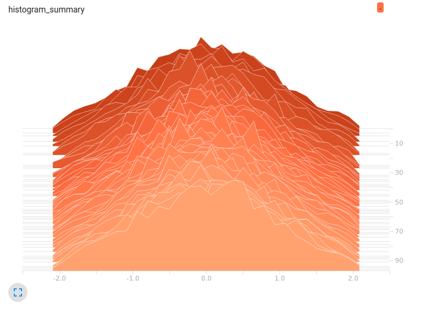

# AI-application-systems - Timur Khairulov (12224993)

# 
### Goals of week 3:
- [x] Learn how does a single neuron work
- [x] Learn how does a backpropagation algorithm work
- [x] Implement a simple neural network without frameworks
- [x] Train a network to solve the XOR problem

### XOR Problem

For solving a XOR problem the following structure of neural network was developed


It has 2 inputs, 1 hidden layer containing 2 neurons and 1 output neuron

### Backpropagation
The backpropagation algorithm consists of 3 steps:
1. forward_pass

```python
def forward_pass(x):
  """
    First step of back propagation algorithm
  """
  global n_y
  n_y[0] = np.tanh(np.dot(n_w[0],x))
  n_y[1] = np.tanh(np.dot(n_w[1],x))

  n2_inputs = np.array([1.0, n_y[0], n_y[1]])
  z2=np.dot(n_w[2], n2_inputs)
  n_y[2] = 1.0/(1.0 + np.exp(-z2))
 ```
 2. backward_pass
 
 ```python
 def backward_pass(y_truth):
  """
    Second step of back propagation algorithm
  """
  global n_error
  error_prime = -(y_truth - n_y[2])
  derivative = n_y[2] * (1.0 - n_y[2])
  n_error[2] = error_prime * derivative
  derivative = 1.0 - n_y[0]**2
  n_error[0] = n_w[2][1] * n_error[2] * derivative
  derivative = 1.0 - n_y[1]**2
  n_error[1] = n_w[2][2] * n_error[2] * derivative
```
3. adjusting weights
```python
def adjust_weights(x):
  """
    Process of weights adjusting
  """
  global n_w
  n_w[0] -= (x * LEARNING_RATE * n_error[0])
  n_w[1] -= (x * LEARNING_RATE * n_error[1])
  n2_inputs = np.array([1.0, n_y[0], n_y[1]]) # 1.0 is bias
  n_w[2] -= (n2_inputs * LEARNING_RATE * n_error[2])
```

### Result
Eventually, the neural network of 3 neurons learnt to solve the XOR problem


# 
### Goals of week 4:
- [x] Exploring the MNIST dataset

### Result
After downloading the dataset and unpacking it the 6-th element was tasken for observation.
```
label for first training example:  2
---beginning of pattern for first training example---
                            
                            
                            
                            
                            
               *****        
             *******        
           **********       
         ************       
         ******* ****       
         ******  ****       
         ****    ****       
                 ****       
             ********       
          **********        
        *************       
       ****** ********      
      ****** ************   
     ****** ***** *******   
     ***********     ****   
     **********             
     *********              
     ******                 
                            
                            
                            
                            
                            
---end of pattern for first training example---
```
Here we can see that the 6-th element in dataset is a handwritten '2'.


# 
### Goals of week 5:
- [x] Learn how to create variables in tensorflow
- [x] Learn how to create constants in tensorflow
- [x] Learn how to create placeholders in tensorflow
- [x] Learn how to work with the tesorboard
- [x] Learn how to create a computational graph in tensorflow
- [x] Learn how to use `tf.summary.scalar` and `tf.summary.histogram` commands

### Variables in tensorflow
Variables are tensors trainable during a session.
In tensotrflow they are defined using following syntax: `a = tf.Variable(0, name = 'input')`

### Constants in tensorflow
Constants are tensors that are NOT trainable during a session.
In tensotrflow they are defined using following syntax: `b = tf.constant(5)`

### Placeholders
Placeholders are tensors whose values are unknown during the graph construction but passed as input during a session.
They can be defined with this syntax: `x = tf.placeholder("float32", None)`

### Computational graph
Next, we define a computational graph:
```python
a = tf.add(1,2, name="addition_1")
b = tf.multiply(a,3, name="multiplying_1")
c = tf.add(4,5, name="addition_2")
d = tf.multiply(c,6, name="multiplying_2")
e = tf.multiply(4,5)
f = tf.div(c,6, name="division")

g = tf.add(b,d)
h = tf.multiply(g,f)
```
and then we can visualize it via the tensorboard.
Tensorboards are avaliable to be ran inside the cells of google colab.
For enabling inline tensorboard run `%load_ext tensorboard`
and `%tensorboard --logdir='./logs'` with specified logging folder used in program.\
The output of a tensorboard with computational graph looks like this:


## `tf.summary.scalar` and `tf.summary.histogram` commands
To understand how these commands work, let's run a following script:
```python
tf.reset_default_graph()
s_scalar = tf.get_variable(name='s_scalar',
                           shape=[],
                           initializer=tf.truncated_normal_initializer(
                               mean=0,
                               stddev=1
                           ))

y_matrix = tf.get_variable(name='y_matrix',
                           shape=[40,50],
                           initializer=tf.truncated_normal_initializer(
                               mean=0,
                               stddev=1
                           ))

# A scalar summary for scalar tensor
first_summary = tf.summary.scalar(name='First_summary', tensor = s_scalar)

# A histogram summary for non-scalar tensor 2-D and 3-D matrix
histogram_summary = tf.summary.histogram('histogram_summary', y_matrix)

init = tf.global_variables_initializer()

with tf.Session() as sess:
  writer = tf.summary.FileWriter('./logs', sess.graph)

  for i in range(100):
    sess.run(init)
    summary1, summary2 = sess.run([first_summary, histogram_summary])
    writer.add_summary(summary1, i)
    writer.add_summary(summary2, i)
```
Now we can visualize results in tensorboard




# 
### Goals of week 6-1:
- [x] Perform the linear regression using tensorflow
- [x] Show the learning process of a linear regression model
- [x] Design and train neural network for MNIST dataset digit classification
- [x] Test learning parameters on an image from the web

### Linear regression
Let's make a model for linear regression problem and train it
```python
Y = tf.placeholder(tf.float32)
X = tf.placeholder(tf.float32)

W = tf.Variable(np.random.randn(), name = 'weights')
B = tf.Variable(np.random.randn(), name = 'bias')
```
```python
# Create model for regression
with tf.name_scope("Model") as scope:
  prediciton = W*X + B

# Add summary to study behavior of weights and biases with epochs
weight_histogram = tf.summary.histogram("Weights", W)
bias_histogram = tf.summary.histogram("Bias", B)

# Cost function
with tf.name_scope('Cost_function') as scope:
  cost_function = tf.reduce_sum((prediction-Y)**2 / (2*sample_points))

# Record the scalar summary of the cost funciton
cost_summary = tf.summary.scalar("Cost", cost_iteration)

# Define the optimizer
with tf.name_scope("Training") as scope:
  optimizer = tf \
              .train \
              .GradientDescentOptimizer(learning_parameter) \
              .minimize(cost_iteration)

# Initialize the variables
init = tf.global_variables_initializer()

# Merge all the summaries into a single operator
merged_summary = tf.summary.merge_all()
```
Result:

As we can see, model works and we received the desired output.
Red line represents the trained model and blue dots represent data.

### Neural Network for MNIST digit classification
At first, we need to define parameters of neural network
```python
n_input = 784 # Input image of size 28 x 28
n_hidden_1 = 512 # First hidden layer
n_hidden_2 = 256 # Second hidden layer
n_hidden_3 = 128 # Third hidden layer
n_output = 10 # Output layer having (0-9) digits

learning_rate = 1e-4
epochs = 3000
batch_size = 128
```
Next step is to connect layers and create the network
```python
nn_weight = {"W1" : tf.Variable(tf.truncated_normal([n_input, n_hidden_1], stddev=0.1)),
             "W2" : tf.Variable(tf.truncated_normal([n_hidden_1, n_hidden_2], stddev=0.1)),
             "W3" : tf.Variable(tf.truncated_normal([n_hidden_2, n_hidden_3], stddev=0.1)),
             "Wout" : tf.Variable(tf.truncated_normal([n_hidden_3, n_output]))
}

nn_bias = {"B1" : tf.Variable(tf.truncated_normal([n_hidden_1])),
           "B2" : tf.Variable(tf.truncated_normal([n_hidden_2])),
           "B3" : tf.Variable(tf.truncated_normal([n_hidden_3])),
           "B4" : tf.Variable(tf.truncated_normal([n_output]))
}

nn_layer_1 = tf.add(tf.matmul(X, nn_weight["W1"]), nn_bias["B1"])
nn_layer_2 = tf.add(tf.matmul(nn_layer_1, nn_weight["W2"]), nn_bias["B2"])
nn_layer_3 = tf.add(tf.matmul(nn_layer_2, nn_weight["W3"]), nn_bias["B3"])
layer_drop = tf.nn.dropout(nn_layer_3, keep_prob)
output_layer = tf.add(tf.matmul(layer_drop, nn_weight["Wout"]), nn_bias["B4"])
```

Choosing loss, prediction, optimizer and model accuracy
```python
# Define the loss
computed_loss = tf.reduce_mean(tf.nn.softmax_cross_entropy_with_logits_v2(
              logits=output_layer, labels=Y)
)

# Define the optimizer
optimizer = tf\
            .train\
            .GradientDescentOptimizer(learning_rate = learning_rate)\
            .minimize(computed_loss)

# Define prediction
prediction_out = tf.equal(tf.argmax(output_layer,1), tf.argmax(Y,1))

# Define accuracy of model
nn_accuracy = tf.reduce_mean(tf.cast(prediction_out, tf.float32))
```
After training all parameters were saved to a file, so they could be used further in a new model
```
Optimization Finished
Testing accuracy is 0.8561999797821045
```

### Testing on an image
For the test, an image of '7' was downloaded from the web.\
Next, we can use previously saved weights to create a new model that will make a prediction.\
Result:\

